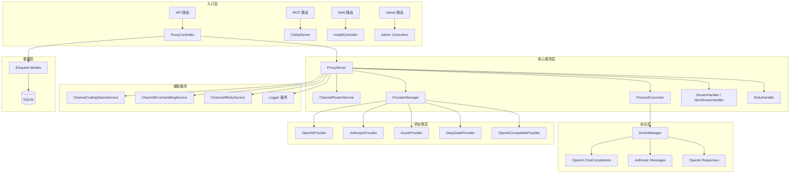

# CdApi Laravel 模块

> 📍 导航：[根级 CLAUDE.md](../CLAUDE.md) → `laravel/`

## 模块概述

Laravel 应用是 CdApi 的核心实现层，包含所有业务逻辑、API 端点、后台管理和数据模型。基于 Laravel 12 + Dcat Admin v2 构建，作为 AI 大模型 API 网关的完整后端。

## 架构总览



## 目录结构

```
laravel/
├── app/
│   ├── Admin/                    # Dcat Admin 后台管理
│   │   ├── Controllers/          #   管理控制器（28个）
│   │   ├── Controllers/Actions/  #   管理动作
│   │   ├── Grids/                #   自定义 Grid 组件
│   │   ├── Actions/              #   行操作和批量操作（13个）
│   │   ├── Widgets/              #   仪表盘图表组件
│   │   │   ├── StatsCharts/      #     统计图表（3个）
│   │   │   └── DemoCharts/       #     演示图表（11个）
│   │   └── Extensions/           #   Grid 扩展（Displayer）
│   ├── Console/Commands/         # Artisan 命令（20个，cdapi: 前缀）
│   ├── Enums/                    # 应用枚举类（8个）
│   ├── Helpers/                  # 辅助函数
│   ├── Http/
│   │   ├── Controllers/
│   │   │   ├── Api/              #   API 控制器（ProxyController）
│   │   │   ├── InstallController #   安装向导
│   │   │   └── UpgradeController #   升级向导
│   │   └── Middleware/           #   中间件（4个）
│   ├── Livewire/                 # Livewire 组件
│   ├── Mcp/                      # MCP 服务
│   │   ├── Servers/              #   MCP Server（CdApiServer）
│   │   └── Tools/                #   MCP Tool（Search、WebParser）
│   ├── Models/                   # Eloquent 模型（34个）
│   ├── Policies/                 # 授权策略
│   ├── Providers/                # 服务提供者（5个）
│   └── Services/                 # 核心业务服务
│       ├── Backup/               #   数据备份
│       ├── ChannelAffinity/      #   渠道亲和性
│       │   ├── DTO/              #     亲和性数据传输对象
│       │   └── Exceptions/       #     亲和性异常
│       ├── CodingStatus/         #   Coding 状态管理
│       │   └── Drivers/          #     状态驱动（9个）
│       ├── Install/              #   安装服务
│       ├── Pricing/              #   定价服务
│       ├── Protocol/             #   协议转换 ⭐
│       │   ├── Contracts/        #     协议契约接口
│       │   ├── Driver/           #     协议驱动
│       │   │   ├── OpenAI/       #       OpenAI ChatCompletions DTO（19个）
│       │   │   ├── Anthropic/    #       Anthropic Messages DTO（7个）
│       │   │   ├── OpenAIResponses/ #    Responses API DTO（3个）
│       │   │   └── Concerns/     #       可复用 Trait（5个）
│       │   └── Exceptions/       #     协议异常
│       ├── Provider/             #   供应商驱动 ⭐
│       │   ├── Driver/           #     供应商实现（6个）
│       │   └── Exceptions/       #     供应商异常
│       ├── Response/             #   响应状态管理
│       ├── Router/               #   请求路由 ⭐⭐⭐
│       │   ├── Handler/          #     流式/非流式处理器
│       │   └── Logger/           #     日志记录器（3个）
│       ├── Search/               #   搜索服务
│       │   ├── Contracts/        #     搜索契约
│       │   ├── Driver/           #     搜索驱动（5个）
│       │   └── Exceptions/       #     搜索异常
│       ├── Shared/               #   共享数据结构 ⭐
│       │   ├── DTO/              #     标准 DTO（12个）
│       │   └── Enums/            #     共享枚举（6个）
│       ├── UserAgent/            #   User-Agent 分组服务
│       └── WebParser/            #   网页解析服务
├── bootstrap/                    # 应用引导
│   ├── app.php                   #   中间件和异常配置
│   └── providers.php             #   服务提供者注册
├── database/migrations/          # 数据库迁移（79个）
├── routes/                       # 路由定义
│   ├── api.php                   #   API 代理路由
│   ├── ai.php                    #   MCP 服务路由
│   ├── web.php                   #   Web 路由
│   ├── console.php               #   定时任务调度
│   └── install.php               #   安装/升级路由
└── tests/                        # 测试（26个文件）
    ├── Unit/                     #   单元测试
    ├── Feature/                  #   功能测试
    └── E2E/                      #   端到端测试
```

## 核心服务架构

### ProxyServer — 请求代理核心

`app/Services/Router/ProxyServer.php` 是整个系统的核心入口，协调以下流程：

1. **协议解析** → 通过 `ProtocolConverter` 解析入站请求格式
2. **渠道选择** → 通过 `ChannelRouterService` 选择上游渠道
3. **协议转换** → 如需转换，通过 `Shared\DTO` 中间层完成
4. **请求发送** → 通过 `ProviderManager` 驱动发送到上游
5. **响应处理** → `StreamHandler` / `NonStreamHandler` 处理响应
6. **日志记录** → `RequestLogger` / `AuditLogger` / `ResponseLogger` 记录
7. **故障重试** → `RetryHandler` 处理失败重试和故障转移

### 协议转换层（Protocol）

采用 **Driver + Shared DTO** 模式实现协议互转：

```
OpenAI Request → OpenAI DTO → Shared DTO → Anthropic DTO → Anthropic Request
```

- **DriverInterface**：定义协议驱动的解析、构建、流式处理接口
- **ProtocolRequest / ProtocolResponse**：协议请求/响应契约
- **Shared\DTO**：协议无关的中间数据结构（Request、Response、StreamChunk 等）

| 协议驱动 | 入站格式 | DTO 文件数 |
|---------|---------|-----------|
| OpenAiChatCompletionsDriver | OpenAI Chat Completions | 19 |
| AnthropicMessagesDriver | Anthropic Messages | 7 |
| OpenAIResponsesDriver | OpenAI Responses API | 3 |

### 供应商驱动层（Provider）

通过 `ProviderManager` 管理，每个供应商实现 `ProviderInterface`：

| 供应商 | 类名 | 说明 |
|-------|------|------|
| OpenAI | OpenAIProvider | 官方 OpenAI API |
| Anthropic | AnthropicProvider | 官方 Anthropic API |
| Azure | AzureProvider | Azure OpenAI 服务 |
| DeepSeek | DeepSeekProvider | DeepSeek API |
| 兼容 | OpenAICompatibleProvider | 通用 OpenAI 兼容接口 |

### 渠道路由（ChannelRouterService）

渠道选择策略：
- **加权随机**：按渠道权重随机分发
- **故障转移**：自动切换到可用渠道
- **渠道亲和性**：指定来源匹配同一渠道
- **API Key 限制**：Key 级别的渠道访问控制

### Coding 状态管理（CodingStatus）

基于 Driver 模式的状态管理，9种驱动策略：

| 驱动 | 策略 |
|------|------|
| RequestCodingStatusDriver | 请求数限制 |
| TokenCodingStatusDriver | Token 数限制 |
| SlidingRequestCodingStatusDriver | 滑动窗口请求数 |
| SlidingTokenCodingStatusDriver | 滑动窗口 Token 数 |
| Request5ZMCodingStatusDriver | 5分钟区段请求数 |
| GLMCodingStatusDriver | GLM 特殊策略 |
| PromptCodingStatusDriver | Prompt 级策略 |

## API 端点

### OpenAI 兼容端点

| 方法 | 路径 | 说明 |
|------|------|------|
| POST | `/api/openai/v1/chat/completions` | Chat Completions |
| POST | `/api/openai/v1/completions` | Legacy Completions |
| POST | `/api/openai/v1/embeddings` | Embeddings |
| GET | `/api/openai/v1/models` | 模型列表 |
| POST | `/api/openai/v1/responses` | Responses API |

### Anthropic 兼容端点

| 方法 | 路径 | 说明 |
|------|------|------|
| POST | `/api/anthropic/messages` | Messages API |
| POST | `/api/anthropic/v1/messages` | Messages API（v1 前缀） |
| GET | `/api/anthropic/models` | 模型列表 |
| GET | `/api/anthropic/v1/models` | 模型列表（v1 前缀） |

### MCP 端点

| 方法 | 路径 | 说明 |
|------|------|------|
| POST | `/mcp/cdapi` | CdApi MCP Server |

所有 API 端点需通过 `AuthenticateApiKey` 中间件认证。

## 核心数据模型

### 请求链路模型

| 模型 | 表名 | 说明 |
|------|------|------|
| RequestLog | request_logs | 客户端请求日志 |
| AuditLog | audit_logs | 审计日志（请求元数据） |
| ChannelRequestLog | channel_request_logs | 渠道请求日志 |
| ResponseLog | response_logs | 响应日志 |
| ResponseSession | response_sessions | Responses API 会话状态 |

### 渠道与配置模型

| 模型 | 表名 | 说明 |
|------|------|------|
| Channel | channels | 渠道配置 |
| ChannelModel | channel_models | 渠道模型关联 |
| ChannelGroup | channel_groups | 渠道分组 |
| ChannelTag | channel_tags | 渠道标签 |
| ApiKey | api_keys | API Key 配置 |
| ModelList | model_lists | 模型列表（含别名） |
| SystemSetting | system_settings | 系统设置 |

### Coding 管理模型

| 模型 | 表名 | 说明 |
|------|------|------|
| CodingAccount | coding_accounts | Coding 账户 |
| CodingQuotaUsage | coding_quota_usages | 配额使用记录 |
| CodingUsageLog | coding_usage_logs | 使用日志 |
| Coding5ZMQuota | coding_5zm_quotas | 5分钟区段配额 |
| Coding5ZMStatusLog | coding_5zm_status_logs | 5分钟区段状态日志 |
| CodingSlidingWindow | coding_sliding_windows | 滑动窗口数据 |
| CodingSlidingUsageLog | coding_sliding_usage_logs | 滑动窗口使用日志 |
| CodingStatusLog | coding_status_logs | 状态变更日志 |
| ChannelErrorRule | channel_error_rules | 渠道错误规则 |
| ChannelErrorHandlingLog | channel_error_handling_logs | 错误处理日志 |

### 其他模型

| 模型 | 表名 | 说明 |
|------|------|------|
| ChannelAffinityCache | channel_affinity_caches | 渠道亲和性缓存 |
| ChannelAffinityRule | channel_affinity_rules | 渠道亲和性规则 |
| McpClient | mcp_clients | MCP 客户端配置 |
| SearchDriver | search_drivers | 搜索驱动配置 |
| SearchLog | search_logs | 搜索日志 |
| UserAgent | user_agents | User-Agent 管理 |
| PresetPrompt | preset_prompts | 预设提示词 |
| ModelTestLog | model_test_logs | 模型测试日志 |
| OperationLog | operation_logs | 操作日志 |

## 中间件

| 中间件 | 应用范围 | 说明 |
|--------|---------|------|
| AuthenticateApiKey | api 路由组 | API Key 认证（支持 Bearer / X-API-Key / query） |
| CheckCodingQuota | api 路由组 | Coding 配额检查 |
| SetUserInfo | web 中间件 | 设置用户信息 |
| SetAdminLocale | admin | 设置后台语言 |

## 服务提供者

| 提供者 | 注册内容 |
|--------|---------|
| AppServiceProvider | 应用基础服务 |
| ProtocolServiceProvider | Protocol DriverManager 单例 |
| ProviderServiceProvider | ProviderManager 单例 |
| RouterServiceProvider | ProxyServer、ChannelRouterService 等 |
| SearchServiceProvider | SearchDriverManager 单例 |

## 定时任务

| 任务 | 频率 | 说明 |
|------|------|------|
| `cdapi:coding:auto-reopen` | 每5分钟 | 自动重新开启被禁用的 Coding 账户 |

## 安装与升级

- `/install` 路由提供 Web 安装向导（环境检查、数据库配置、迁移执行、管理员创建）
- `/upgrade` 路由提供升级功能
- 安装路由使用空中间件组，避免 APP_KEY 缺失时报错

## 开发规范

### 代码风格

- 遵循 Laravel 和 PHP 最佳实践
- 使用 PHP 8+ 特性（构造器属性提升、枚举等）
- 要有中文注释
- 运行 Pint 格式化：`vendor/bin/pint --dirty --format agent`

### 前端资源

- **禁止使用 CDN 资源**
- **不使用 Vite 进行资源构建**
- Dcat Admin v2 已包含所需的前端资源

### 数据库操作

- 使用 Eloquent ORM 和模型关系
- 创建迁移文件进行数据库变更
- 默认使用 SQLite

### 服务注册

- 服务提供者在 `bootstrap/providers.php` 中注册
- Console 命令放在 `app/Console/Commands/` 会自动注册
- 中间件在 `bootstrap/app.php` 中配置

### 测试

- PHPUnit 配置：`phpunit.xml`
- 使用内存 SQLite（`:memory:`）
- 测试隔离：`processIsolation="true"`
- 运行测试：`composer test` 或 `php artisan test`
- 运行单个测试：`php artisan test --filter TestClassName`

## 常用命令

```bash
cd laravel

# 依赖安装
composer install

# 运行测试
composer test

# 代码格式化
vendor/bin/pint --dirty --format agent

# Tinker 调试
php artisan tinker

# 查看所有 cdapi 命令
php artisan list | grep cdapi

# 清除缓存
php artisan config:clear
php artisan route:clear
php artisan view:clear
```

## 关键依赖

| 包名 | 版本 | 说明 |
|------|------|------|
| laravel/framework | ^12.0 | Laravel 框架 |
| dongasai/dcat-admin2 | dev-laravel12 | Dcat Admin 后台 |
| anthropic-ai/sdk | ^0.6.0 | Anthropic PHP SDK |
| openai-php/laravel | ^0.19.0 | OpenAI Laravel 集成 |
| openai-php/client | ^0.19.1 | OpenAI PHP 客户端 |
| laravel/mcp | ^0.6.4 | Laravel MCP 支持 |
| laravel/ai | ^0.4.2 | Laravel AI 支持 |
| mcp/sdk | dev-main | MCP SDK |
| opis/json-schema | ^2.6 | JSON Schema 验证 |
| symfony/panther | ^2.4 | 无头浏览器测试 |
| phiki/phiki | ^2.0 | 代码高亮 |

## 注意事项

- 服务器已启动，修改代码后 Laravel 自动生效，无需重启
- 工作目录始终在 `laravel/` 目录下
- 不提交敏感信息和配置（.env 已在 .gitignore）
- Admin 控制器按资源组织，一个模型一个控制器
- 所有自定义 Artisan 命令使用 `cdapi:` 前缀

---

**文件统计**：PHP 源文件 271 个 | 迁移文件 79 个 | 测试文件 26 个
**更新日期**：2026-07-26
